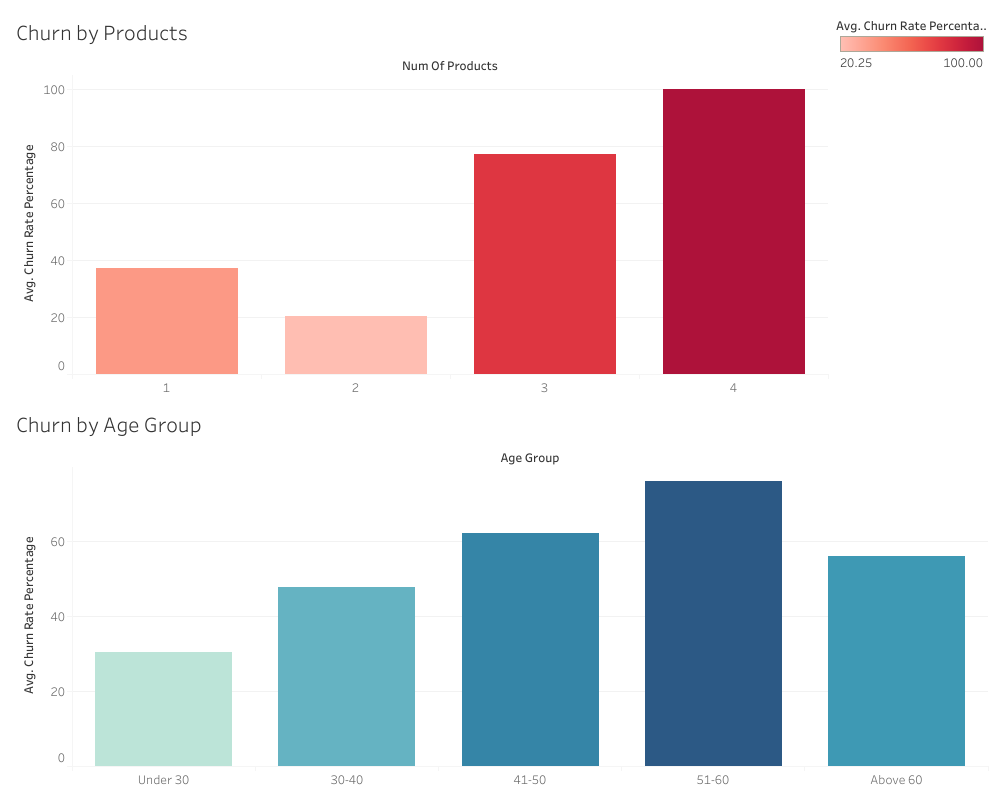

# Bank Customer Churn Analysis: Data-Driven Retention Strategy

## Project Overview
Customer retention is one of the primary challenges in the banking sector. This case study focuses on analyzing bank customer data to uncover the root causes of customer churn (attrition). By identifying the specific customer segments and behavior patterns that lead to churn, this project provides data-driven recommendations to help the bank mitigate risks and design targeted retention campaigns.

## Tech Stack & Methodology
To complete this analysis, a full end-to-end data pipeline was established:
* **SQL (BigQuery):** Used for data cleaning, handling missing values, and performing initial aggregations to calculate churn rates across various metrics.
* **R (RStudio):** Utilized for exploratory data analysis (EDA) using `tidyverse` and `ggplot2` to validate findings and generate baseline charts.
* **Tableau:** Employed to build an interactive business dashboard for final reporting and visualization.

##  Key Insights
### 1. The Product Multiplicity Crisis (NumOfProducts)
* **100% Churn Rate:** Customers who hold **3 or 4 products** have a staggering churn rate of nearly 100%. 
* **Business Implication:** This strongly indicates an underlying issue with the bank's cross-selling strategy, pricing packages, or the perceived value of multi-product bundles.

### 2. High-Risk Demographics (Age Groups)
* **Middle-Aged Vulnerability:** The churn rate peaks significantly among customers aged **41–50** and **51–60**.
* **Business Implication:** The bank is losing customers during their peak financial maturity, which directly impacts long-term profitability and asset value.

## Interactive Dashboard
Below is the final Tableau Dashboard summarizing the findings:

## Actionable Business Recommendations
1. **Review Multi-Product Bundles:** Conduct an immediate review of the products offered to customers holding 3 or 4 accounts/services. Restructure the fee systems or introduce relationship-manager support to improve retention.
2. **Targeted Retention Campaigns for 41-60 Age Group:** Design specific loyalty programs and financial advisory products tailored to middle-aged customers to enhance their engagement and increase switching costs.
